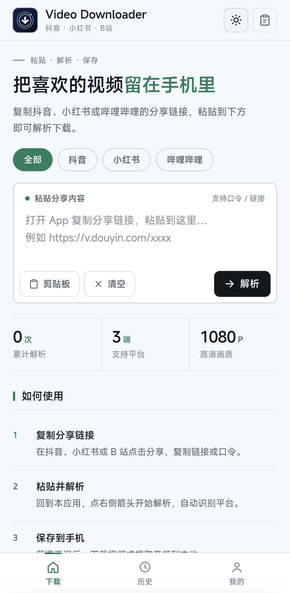

# Video Downloader

把单页 H5 应用打包成安卓 APK 的 WebView 壳工程。应用名「Video Downloader」,支持解析/下载抖音、小红书、哔哩哔哩的视频与音频。



> **来源说明**:本项目参考 galaxy-downloader 项目搭建,页面源码(`index.html` / `css` / `js` / `img`)与图标素材来自该项目,此后独立维护。上游仍在演进,本仓库 `app/src/main/assets/` 下的页面是它的同步副本。

> **开发规则**:改代码前必读 [`AGENT.md`](AGENT.md) —— 架构硬性约束、页面同步流程、调试手段与已知坑都在那里。

## 环境要求

| 依赖 | 版本 / 说明 |
|---|---|
| JDK | 17(设 `JAVA_HOME`,或在 `gradle.properties` 里写 `org.gradle.java.home`) |
| Android SDK | `platforms;android-35`、`build-tools;35.0.0`、platform-tools |
| Python | 3.x,只有浏览器调试预览用得到 |
| Gradle | 无需单独安装,wrapper 8.11.1 会自动下载 |

SDK 路径写在项目根目录的 `local.properties`:

```properties
sdk.dir=/path/to/Android/Sdk
```

该文件不入库,每台机器自建;也可以改用环境变量 `ANDROID_HOME`。

> `settings.gradle.kts` 与 Gradle wrapper 默认走国内镜像(阿里云 / 腾讯)。境外网络可自行换回官方源。

## 一键打包

```bat
scripts\build.bat               :: debug 包
scripts\build.bat release       :: 正式签名包
```

Git Bash / Linux 下用同名的 `.sh`:

```bash
./scripts/build.sh
./scripts/build.sh release
```

脚本会先校验 JDK、SDK(以及 release 所需的签名配置)是否就绪,再执行对应的 Gradle 任务。产物:

```
app/build/outputs/apk/debug/Video Downloader.apk
app/build/outputs/apk/release/Video Downloader.apk
```

等价于手动执行 `./gradlew :app:assembleDebug` / `:app:assembleRelease`。

APK 是 universal 包(不含任何 native 库),arm64-v8a / armeabi-v7a / x86_64 都能装。

> **要给别人装就用 release 包。** debug 包由公开的 `Android Debug` 密钥签名,并且带 `android:debuggable="true"`——装到手机上时系统安全检测会提示「调试版本 / 存在风险」。release 包用自己的密钥签名,不含 debuggable。

## 发布签名

release 包需要一个 keystore。它**绝不会进仓库**(已在 `.gitignore` 排除),但你要自己备份好:**一旦丢失,就无法再给已发布的应用做覆盖升级。**

用 JDK 自带的 `keytool` 生成:

```bash
keytool -genkeypair -v \
  -keystore release.jks \
  -storetype PKCS12 \
  -alias videodownloader \
  -keyalg RSA -keysize 2048 -validity 10000 \
  -dname "CN=你的名字, O=Video Downloader, C=CN"
```

然后在仓库根目录建 `keystore.properties`:

```properties
storeFile=release.jks
storePassword=生成时设置的口令
keyAlias=videodownloader
keyPassword=同上
```

`storeFile` 按仓库根目录解析,所以这个文件里不含任何本机绝对路径。该文件不存在时构建不会失败:`assembleDebug` 照常可用,`assembleRelease` 产出未签名包。

> **换签名密钥后必须先卸载旧版本**再安装,Android 不允许跨密钥覆盖安装(本地历史记录会一并清掉)。

## 调试页面(不用装 APK)

页面由 `index.html` + `css/` + `js/` + `img/` 组成,全部是相对路径引用,**必须走静态服务器**:直接 file:// 打开会断链,IndexedDB / localStorage 的行为也和真实源不一致。APK 内由 `WebViewAssetLoader` 以 https 提供同一棵目录树,所以本地这样起服务最接近真实环境。

```bat
scripts\serve.bat           :: 默认 http://localhost:8123
scripts\serve.bat 9000      :: 指定端口
```

Git Bash / Linux 下用 `./scripts/serve.sh [端口]`。

浏览器里没有 `AppBridge`,所以下载会走回退路径(没有真实进度),剪贴板走 `navigator.clipboard`。**要验原生能力——真实下载进度、底部任务条、剪贴板桥、系统栏适配——必须把 APK 装到真机。**

## 功能

- **资产内嵌**:H5 页面完整打包进 APK(`app/src/main/assets/`),离线可用,不依赖任何本地服务器
- **安全源加载**:通过 `WebViewAssetLoader` 以 `https://appassets.androidplatform.net` 形式加载,IndexedDB / localStorage / fetch 与真实站点行为一致
- **原生下载管线**:页面通过 `AppBridge.download(url, filename)` 调用系统 `DownloadManager`;原生轮询字节数,经 `window.__nativeDownload.{start,progress,done,cancelled}` 实时驱动页面进度条;完成后弹「已保存到本地」对话框,可一键打开相册/播放器查看
- **后台任务条**:底部常驻任务条由真实事件驱动,显示文件名 / 已下载大小 / 百分比,关掉解析弹窗后任务照跑;支持暂停(取消任务行)与取消
- **下载目录按媒体类型分流**:视频存 `Movies/Video Downloader/`、音频存 `Music/Video Downloader/`(系统相册必扫的媒体集合,保证相册可见),其余存 `Download/Video Downloader/`
- **坏内容守卫**:上游限流或链接过期时会返回 200 + 错误体,按 Content-Type 与文件头魔数(ftyp / EBML / RIFF / ID3 …)双重校验,非已知媒体容器一律判坏并删除,避免存成假视频
- **剪贴板桥**:`AppBridge.readClipboard / writeClipboard` 兜底,规避 WebView `navigator.clipboard.readText` 在 MIUI 等国产 ROM 上被拒绝的问题
- **边到边全面屏适配**:系统栏不做原生 padding,而是把真实 inset 注入成页面的 `--safe-t` / `--safe-b`。顶栏背景因此能一直画到状态栏底下(内容自己下移),底栏背景铺到屏幕最底,不会出现「状态栏一条色带」的分层感
- **系统栏配色跟随主题**:页面切换日/夜间时通过桥把当前底色回报原生,状态栏底色与图标明暗同步,深色模式下不会黑图标压黑底
- **版本自报**:关于页展示壳上报的真实 `versionName (versionCode)`,便于确认设备上装的是哪个包
- 桥的 JS 接口带域名守卫,仅对本应用的 `appassets.androidplatform.net` 源生效

## 目录结构

```
video-downloader/
├── app/
│   ├── build.gradle.kts              # AGP 8.7.3 / compileSdk 35 / minSdk 26
│   └── src/main/
│       ├── assets/                   # H5 页面(index.html + css/ js/ img/)
│       ├── java/.../MainActivity.java # WebView 壳 + AppBridge + 下载管理
│       ├── res/                      # 图标(mipmap 各密度)、主题、文案
│       └── AndroidManifest.xml
├── art/icon-source.png               # 应用图标源图
├── scripts/                          # 一键打包 / 本地预览脚本
├── gradle/wrapper/                   # Gradle 8.11.1
├── demo.jpg                          # 首页截图
├── AGENT.md                          # 开发规则与架构约束
├── build.gradle.kts
├── settings.gradle.kts
└── gradle.properties
```

## 更新页面

页面源码在上游 galaxy-downloader 项目中维护,**不要只改本仓库的 `app/src/main/assets/` 造成单向漂移**。更新后整树同步进来再构建:

```bash
# <upstream> = 上游 galaxy-downloader 的检出目录
cp <upstream>/index.html app/src/main/assets/index.html
cp -r <upstream>/css <upstream>/js <upstream>/img app/src/main/assets/
./scripts/build.sh
```

改完页面务必跑一次 JS 语法检查(有语法错误整个壳会白屏):

```bash
node --check app/src/main/assets/js/app.js
```

## 包名说明

`applicationId` 保持为 `com.galaxy.downloader`(与已安装的历史版本兼容,覆盖安装即升级)。如需完全独立的身份,改 `app/build.gradle.kts` 中的 `applicationId` 与 `AndroidManifest.xml` 即可。

## 合规说明

本应用**未进行 APP 备案**。中国大陆地区的手机系统(小米 / 华为 / OPPO / vivo 等)在安装时会比对工信部备案库,未备案的应用会被提示「未查询到备案信息」。这是系统级的合规提示,与本项目的代码无关——**改签名、改包名、改构建配置都无法消除**。

- 本仓库仅供**个人学习与技术研究**,不提供公开的在线服务,也不面向中国大陆地区做商业分发;
- 自行安装时若被系统拦截,属于预期现象,请自行判断是否继续;
- 如需在境内合规分发,须以企业或个人主体完成 APP 备案,且服务内容需与备案类目相符(本项目不提供此类合规支持)。

## 免责声明

仅供个人学习与备份用途,请尊重原作者版权,勿用于商业分发。
